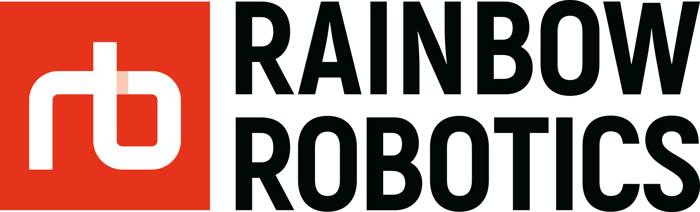

We touch the core.

<table><tbody>

    
    Open source projects 

<table class="table table-striped table-bordered table-vcenter"/>
    <tbody>
    <tr> <th> Title </th> <th>Description</th> </tr>
    <tr>
        <td colspan="1" rowspan="1" align="center">
            <a href="https://github.com/RainbowRobotics/RBQ" target="_blank"> RBQ </a>
        </td>
        <td> Rainbow Robotics Quadrupedal robot repository. </td>
    </tr>
    <tr>
        <td colspan="1" rowspan="2" align="center"> <a href="https://rainbowrobotics.github.io/rby1-dev/" target="_blank"> RBY1 </a> </td>
        <td> <a href="https://github.com/RainbowRobotics/rby1-sdk" target="_blank"> rby1-sdk  </a>   Y1 sdk </td>
    </tr>
    <tr> <td> <a href="https://github.com/RainbowRobotics/rby1_ros2" target="_blank"> rby1_ros2  </a>   Y1 ros2 </td> </tr>
    </tbody>
</table>
